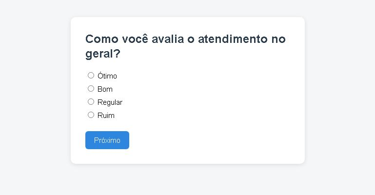

# 📋 Avaliação Simples — Formulário PHP

Formulário de avaliação de atendimento construído em **PHP puro**, com navegação por etapas (uma pergunta por página) usando sessão (`$_SESSION`). Projeto criado como estudo para praticar lógica de formulários, sessões e manipulação de arquivos em PHP.



## ✨ Funcionalidades

- Formulário dividido em 3 perguntas sobre o atendimento (uma por página)
- Validação simples: não deixa avançar sem escolher uma resposta
- Campo de comentário opcional ao final
- Respostas salvas automaticamente em um arquivo `avaliacoes.txt`
- Página `respostas.php` para visualizar todas as avaliações recebidas em formato de tabela

## 🛠️ Tecnologias

- PHP puro (sem frameworks)
- Sessões (`$_SESSION`) para guardar as respostas entre as páginas
- HTML + CSS simples, sem dependências externas

## 🚀 Como rodar o projeto

```bash
# Clone o repositório
git clone https://github.com/Jeanhenrique2/Avaliacao-simples.git

# Entre na pasta
cd Avaliacao-simples

# Inicie o servidor embutido do PHP
php -S localhost:8000

# Abra no navegador
http://localhost:8000/pergunta1.php
```

## 📁 Estrutura do projeto

```
avaliacao-simples/
├── layout.php       # Estilo e estrutura HTML reutilizados em todas as páginas
├── pergunta1.php     # 1ª pergunta do formulário
├── pergunta2.php     # 2ª pergunta do formulário
├── pergunta3.php     # 3ª pergunta do formulário
├── comentario.php    # Campo de comentário opcional
├── finalizar.php     # Salva as respostas e mostra agradecimento
└── respostas.php      # Lista todas as avaliações já recebidas
```

## 📚 O que pratiquei neste projeto

- `$_SESSION` para manter dados entre páginas diferentes
- `$_POST` para capturar dados enviados por formulários
- `header('Location: ...')` para redirecionar o usuário
- `file_put_contents()` e `file()` para salvar e ler dados em arquivo
- Validação básica de formulário no lado do servidor

## 👤 Autor

Feito por **Jean Henrique** como parte dos estudos em PHP.
Sinta-se à vontade para deixar sugestões ou abrir uma *issue*! 🙌
